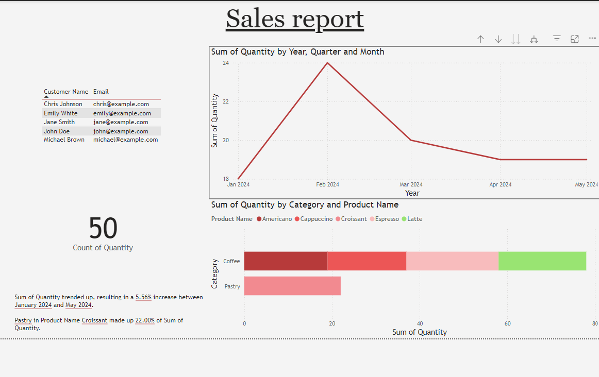
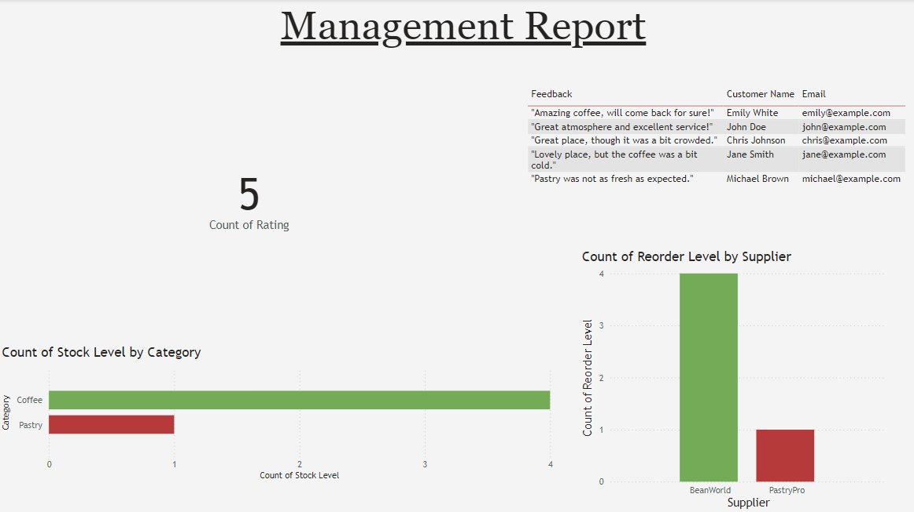

# BrewHeaven Analytics Dashboard

A unified business intelligence solution developed for Brew Heaven, a local coffee shop chain, to transform their data management and decision-making process.

## Project Overview
This Power BI dashboard consolidates multiple data sources (sales, inventory, and customer feedback) into a single, intuitive interface, solving the challenge of disconnected Excel spreadsheets and providing actionable insights for business growth.

## Business Problem
Brew Heaven was facing challenges with:
- Disconnected data across multiple Excel spreadsheets
- Difficulty in tracking real-time sales trends
- Inefficient inventory management
- Limited visibility into customer satisfaction metrics

## Solution
An interactive Power BI dashboard that:
- Unifies all data sources into one platform
- Provides real-time insights into sales patterns
- Tracks inventory levels and alerts
- Analyzes customer feedback and satisfaction trends

## Tools Used
- Power BI Desktop
- Power Query for data transformation
- Excel for data sources

## Model view

## Dashboard Link
[View Brew Heaven Analytics Dashboard](https://app.powerbi.com/groups/me/reports/4d20f0a5-c994-489a-87b6-cdfdc58a4cf1/a373679cb2abc12c94b6?experience=power-bi)

The sales page - 

The management page - 

